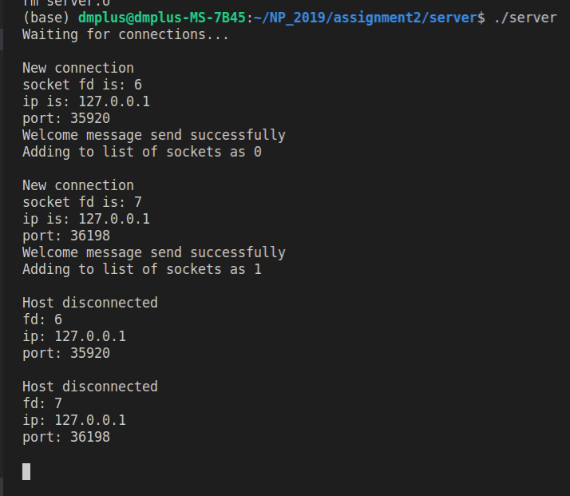
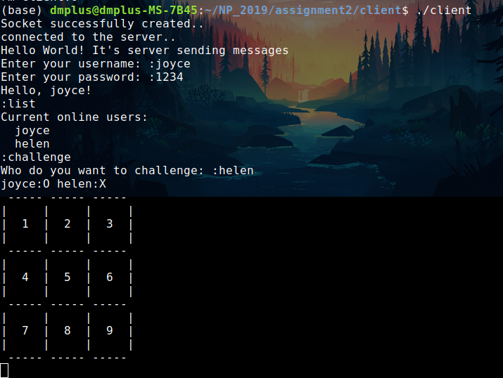
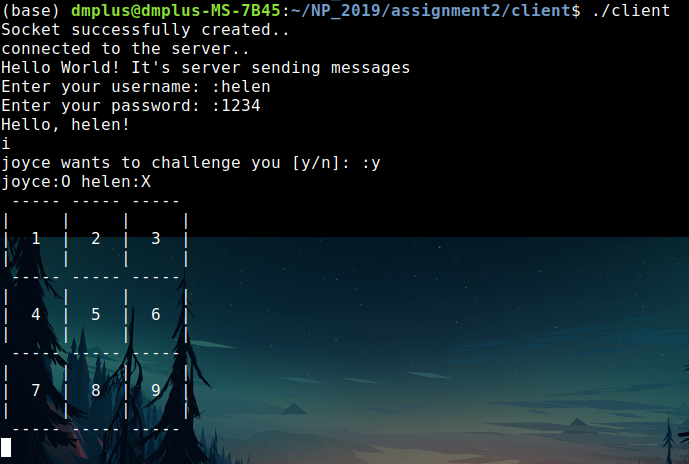
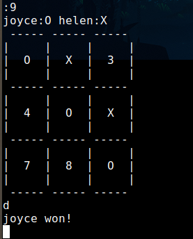

Playing OX Chess Using Network Programming
==

## Table of Contents

- [Introduction](#introduction)
- [Technologies](#technologies)
- [Setup](#setup)
- [Results](#results)
- [Notes](#notes)
- [License](#license)

## Introduction

Build a simple C++ server that have following functionality
1. Let multiple client connect to
2. Client can login
3. Client can list all the other clients
4. Client can challenge other online client (play chess game)
5. Playing chess game

## Technologies

### Prerequisite:
* gcc/g++: recommended version (Ubuntu 7.4.0-1ubuntu1~18.04.1) 7.4.0

### Method Description

Initialize the client socket, create server socket, bind, specify maximum connection at a time, listening for incoming connection

```cpp
sock=socket(AF_INET,SOCK_STREAM,0);
address.sin_family=AF_INET;
address.sin_addr.s_addr=INADDR_ANY;
address.sin_port=htons(PORT);
bind(mysocket,(struct sockaddr *)&address,sizeof(address));
listen(mysocket,MAXIMUM_CONNECTIONS);
```

Initialize socket descriptor setm add child (client) to the set, wait for connection, set timeout=NULL (wait indefinitely)

```cpp
FD_ZERO(&fdset);
FD_SET(mysocket,&fdset);
activity=select(num_of_sockfd,&fdset,NULL,NULL,NULL);
```

Accept incoming connection

```cpp
sockfd=sccpet(mysocket,(struct sockaddr *)&address,(socklen_t *)&addressLength);
ip=inet_ntoa(address.sin_addr);
port=ntohs(address.sin_port);
send(sockfd,message,strlen(message),0);
```

Check if the socket is closing

```cpp
FD_ISSET(sockfd,&fdset);
readMessage=read(sockfd,buffer,MAX_BUFF_SIZE);
getpeername(sockfd,(struct sockaddr *)&addressm(socklen_t *)&addressLength);
close(sockfd);
```

Create client lists

```cpp
typedef struct clientList {
  string username;
  string password;
  bool isOnline;
  int fd;
}ClientList;
```

## Setup

1. change directory to this project directory **assignment2**
2. cd ./server
3. make
4. ./server
5. Open another terminal window **cd ../client**
6. make
7. ./client
8. You can open more terminal window to create more client
9. if you are in the program already everytime you want to enter anything you need to type **:** before any other word
10. Most of the time just follow the instruction print on the screen
11. Ask for service commands: **:list**,**:challenge**

## Results

Server


Client

<div style="display:flex">
     <div style="flex:1;padding-right:5px;">
          
     </div>
     <div style="flex:1;padding-left:5px;">
          
     </div>
     <div style="flex:1;padding-left:5px;">
          
     </div>
</div>

## Notes

You can find notes for this project [here](./notes.md)

## Contact

Created by [@joycenerd](mailto:joycenerd@csie.io)

## License

[](https://opensource.org/licenses/MIT)

