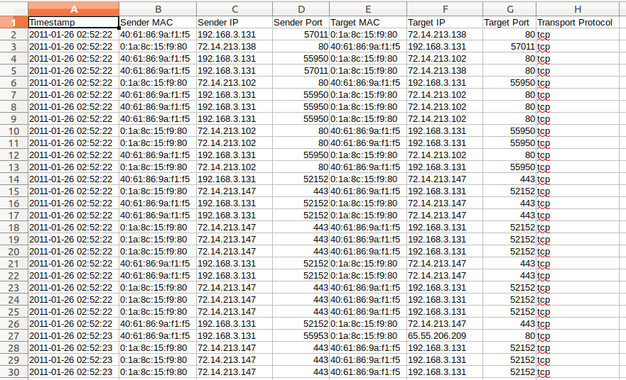
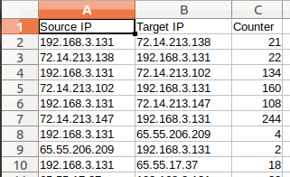

pcap File Reading and Statistics Program
==

## Table of Contents

- [Introduction](#introduction)
- [Technologies](#technologies)
- [Setup](#setup)
- [Results](#results)
- [Notes](#notes)
- [Contact](#contacts)
- [Credits](#credits)
- [Data](#data)
- [License](#license)

## Introduction

Build a simple C++ pcap parser and basic statistic analysis for ip packet
1. Read in pcap file
2. can show timstamp, and MAC address
3. if it is ip packet can show it's ip address and port number
4. Can count the number of packets per pair (source IP, destination IP)

## Technologies

### Prerequisite:
* gcc/g++: recommended version (Ubuntu 7.4.0-1ubuntu1~18.04.1) 7.4.0
* libpcap-dev: recommended version  1.8.1-6ubuntu1.18.04.1 `sudo apt install libpcap-dev`

### Method Description

Read packet from pcap file into our C++ program

```cpp
pcap=pcap_open_offline(argv[2],errbuf);

while(packet=pcap_next(pcap,&header)) {
    if(packet==NULL) break;
    parsePacket(packet,header.ts,&header);
    cout <<"packet No. " << cnt++ << endl; 
}
```

Get the timestamp

```cpp
strftime(buff,20,"%Y-%m-%d %H:%M:%S", localtime(&ts.tv_sec));
```

Get the MAC address

```cpp
string printAddr(u_char *ptr){
    string mac;
    char hexString[20];
    for(int i= 0; i < ETHER_ADDR_LEN;i++){
        sprintf(hexString, "%x", ptr[i]);
        mac += hexString;
        if(i!= ETHER_ADDR_LEN -1){
            mac+=":";
        }
    }
    return mac;
}
```

Parse ip header

```cpp
inet_ntop(AF_INET,&(ip->ip_src),sourceIp,INET_ADDRSTRLEN);
```

Parse tcp header

```cpp
tcpHeader=(tcphdr *)(packet+sizeof(struct ip));
sourcePort = ntohs(tcpHeader->source);
```

Parse udp header

```cpp
udpHeader=(struct udphdr *)(packet+sizeof(struct ip));
sourcePort=htons(udpHeader->uh_sport);
```

Count IP pairs

```cpp
void ipCounter(string source, string dest) {
    for(int i=0;i<ips.size();i++) {
        if(source==ips[i].sourceIp && dest==ips[i].destIp){
            ips[i].counter++;
            return;
        }
    }
    struct ipPairs tmp;
    tmp.sourceIp=source;
    tmp.destIp=dest;
    tmp.counter=1;
    ips.push_back(tmp);
    return;
} 
```

## Setup

1. change directory to this project directory **assignment3**
2. make
3. ./read_pcap -r [your pcap file]
4. **packet_into.csv**: information of all the packet
5. **counter.csv**: statistic result of the number of packets per pair (source IP, destination IP)

## Results

packet_info.csv



--- 

counter.csv



## Notes

You can find notes for this project [here](./notes.md)

## Contact

Created by [@joycenerd](mailto:joycenerd@csie.io)

## Credits

This application uses Open Source components. You can find the source code of their open source projects along with license information below. We acknowledge and are grateful to these developers for their contributions to open source.

Project: CSVWriter https://github.com/al-eax/CSVWriter \
Copyright (c) 2015, All rights reserved. \
License (BSD 2-Clause) https://github.com/al-eax/CSVWriter/blob/master/LICENSE

## Data

The data (pcap file) I'm using is from [Tcpreplay](http://tcpreplay.appneta.com/wiki/captures.html)


## License

[](https://opensource.org/licenses/MIT)